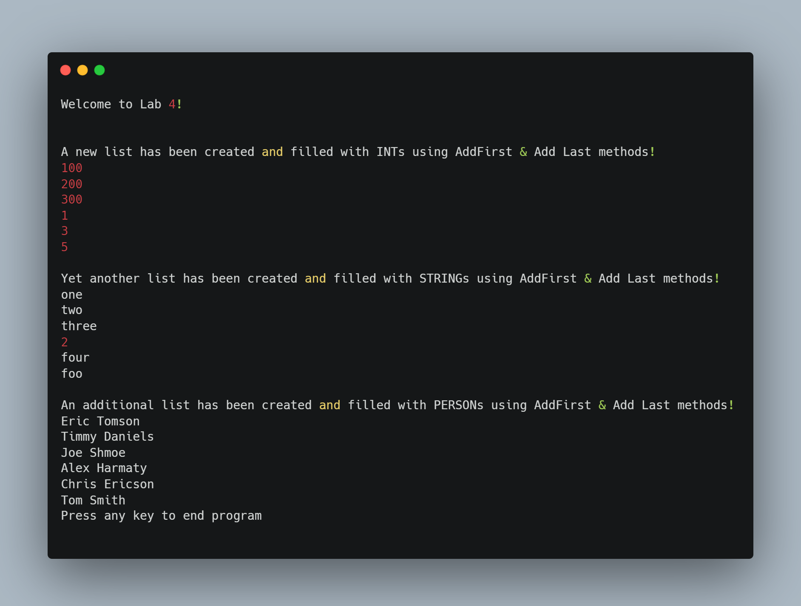

# LinkedList Implements IEnumerable

(FSC-BCS-426-Lab4)

## Output

## Assignment Context

This project was one of the first assignments for my C# Programming class.

The goal of this assignment was for students to further explore C#, so we were prompted to implement a generic LinkedList class using the doubly-linked list data structure.

We were expected to write methods for adding nodes to the list at both the beginning and the end, and to iterate through the list using an enumerator. 
We were to write an example program to demonstrate the functionality of our LinkedList class.

This was a solo assignment made with C#, ASP.NET, and Visual Studio 2022.

## Features

This implementation provides an example program which demonstrates the functionality of the LinkedList class. 
This program creates three different linked lists - one of type int, one of type string, and one of type Person. 
Each list is filled with nodes using the AddFirst and AddLast methods, and the contents of each list are printed to the console using a foreach loop.

## How It Works

The `LinkedList<T>` class includes methods for adding nodes to both the beginning and the end of the list, as well as properties for accessing the first and last nodes.
The program creates new instances of the class and calls the `AddFirst` or `AddLast` methods to add nodes to the respective lists. 
The foreach loop in the Main method calls the `GetEnumerator` method of the `LinkedList<T>` class, which returns an `IEnumerator<T>` object, allowing the loop to iterate through the linked list and return each element one by one using the `MoveNext` method until the end of the list is reached.
